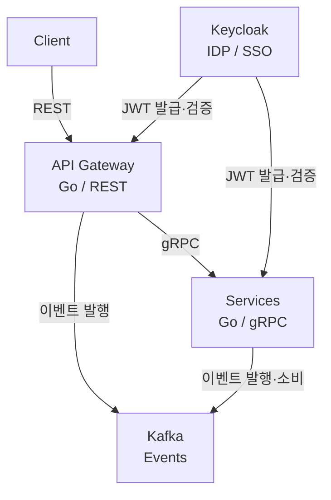

모놀리식에서 마이크로서비스로 넘어가면 코드보다 **구조에 대한 결정**이 훨씬 많아진다. 어떤 프로토콜로 통신할 것인지, 서비스 간 의존성을 어떻게 끊을 것인지, 인증은 어디서 처리할 것인지. 이 글에서는 Go를 기반으로 gRPC, Kafka, Keycloak을 조합한 MSA 구조를 다뤄본다.

각 기술의 깊은 내용은 별도 글에서 다룰 예정이고, 여기서는 전체 그림과 트레이드오프에 집중한다.

## 왜 Go인가

MSA에서 Go가 자주 선택되는 이유는 단순하다.

- **컴파일 바이너리** — 도커 이미지가 수십 MB 수준. 배포가 빠르다
- **고루틴** — 수천 개의 동시 요청을 적은 메모리로 처리할 수 있다
- **빠른 빌드** — CI에서 이미지 만드는 데 몇 초면 충분하다
- **표준 라이브러리가 강력** — HTTP 서버, JSON 파싱 등 외부 의존성 없이도 웬만한 건 된다

물론 Go가 만능은 아니다. 제네릭이 늦게 도입된 탓에 추상화가 좀 투박하고, 에러 처리가 장황하다는 불만은 여전하다. 복잡한 비즈니스 로직이 많은 도메인이라면 Kotlin이나 Java가 더 편할 수도 있다. 하지만 **인프라에 가까운 서비스** — API 게이트웨이, 메시지 브로커 컨슈머, 프록시 — 에서는 Go의 가성비가 압도적이다.

## 서비스 간 통신: gRPC

### REST 대신 gRPC를 쓰는 이유

서비스가 2~3개일 때는 REST로 충분하다. 하지만 서비스가 10개를 넘어가면 이야기가 달라진다.

- REST는 JSON 직렬화/역직렬화 비용이 크다
- API 스키마가 문서에만 존재하면 서비스 간 계약이 깨지기 쉽다
- HTTP/1.1 기반이라 연결 효율이 떨어진다

gRPC는 이 문제를 Protocol Buffers(protobuf)로 해결한다.

```yaml
service UserService {
  rpc GetUser (GetUserRequest) returns (User);
  rpc ListUsers (ListUsersRequest) returns (stream User);
}
```

`.proto` 파일 하나로 서버/클라이언트 코드가 자동 생성된다. 타입이 보장되고, 바이너리 직렬화라 JSON보다 빠르다. HTTP/2 기반이라 하나의 연결에서 여러 요청을 동시에 처리할 수 있다.

### 트레이드오프

| | REST | gRPC |
|---|---|---|
| 가독성 | JSON은 사람이 읽을 수 있다 | 바이너리라 디버깅이 번거롭다 |
| 브라우저 호환 | 그대로 호출 가능 | gRPC-Web이나 프록시 필요 |
| 도구 생태계 | Postman, curl 등 풍부 | grpcurl, Bloom 등 별도 도구 필요 |
| 스키마 | OpenAPI(선택) | protobuf(강제) |
| 성능 | 충분히 빠름 | 직렬화/역직렬화 2~10배 빠름 |

**판단 기준**: 외부 클라이언트(웹, 모바일)와 직접 통신하는 API Gateway는 REST, 내부 서비스 간 통신은 gRPC. 이 조합이 가장 현실적이다.

gRPC를 쓴다고 모든 서비스 간 통신을 동기 호출로 가져가면 안 된다. 동기 호출이 늘어날수록 서비스 간 결합도가 올라가고, 한 서비스의 장애가 전파된다. 여기서 이벤트 기반 통신이 필요해진다.

## 이벤트 기반 아키텍처: Kafka

### 왜 이벤트인가

주문 서비스가 결제 서비스를 직접 호출하고, 결제 서비스가 재고 서비스를 호출하고… 이렇게 체이닝하면 **분산 모놀리스**가 된다. 마이크로서비스의 독립 배포라는 장점이 사라지는 거다.

이벤트 기반으로 바꾸면:

1. 주문 서비스: "주문이 생성됐다"는 이벤트를 발행
2. 결제 서비스: 해당 이벤트를 구독해서 결제 처리
3. 재고 서비스: 같은 이벤트를 구독해서 재고 차감

서비스들이 서로를 직접 알 필요가 없다. 각자 이벤트만 보고 움직인다.

### 왜 Kafka인가

메시지 브로커는 RabbitMQ, AWS SQS, Redis Streams 등 여러 선택지가 있다. Kafka가 MSA에서 자주 쓰이는 이유는:

- **로그 기반 저장** — 메시지가 디스크에 순서대로 저장된다. 컨슈머가 죽어도 메시지가 사라지지 않는다
- **리플레이 가능** — 과거 이벤트를 다시 읽을 수 있다. 새 서비스를 추가할 때 기존 이벤트를 재처리할 수 있다
- **파티셔닝** — 토픽을 파티션으로 나눠 병렬 처리. 수평 확장이 쉽다
- **컨슈머 그룹** — 같은 이벤트를 여러 서비스가 독립적으로 소비

### 트레이드오프

Kafka는 강력하지만 복잡하다.

- **운영 부담이 크다** — Zookeeper(또는 KRaft), 브로커, 파티션 관리. 소규모 팀에겐 과할 수 있다
- **이벤트 순서 보장은 파티션 단위** — 전체 순서가 필요하면 파티션을 1개로 제한해야 하는데, 그러면 병렬 처리의 의미가 없다
- **이벤츄얼 컨시스턴시** — 이벤트가 전파되기까지 지연이 있다. "결제 완료했는데 주문 상태가 아직 안 바뀜" 같은 상황이 생긴다
- **디버깅이 어렵다** — 동기 호출은 스택트레이스를 따라가면 되지만, 이벤트 기반은 어디서 뭐가 발행되고 소비됐는지 추적 도구(분산 트레이싱)가 필요하다

**판단 기준**: 서비스가 3개 이하면 RabbitMQ나 Redis Streams로 충분하다. 이벤트 리플레이가 필요하거나, 서비스 수가 많거나, 데이터 파이프라인까지 고려한다면 Kafka.

## 인증과 인가: Keycloak과 IDP

### 마이크로서비스에서 인증이 복잡해지는 이유

모놀리식에서는 세션 하나로 끝난다. 그런데 MSA에서는 서비스마다 인증 로직을 넣을 수 없다. 그리고 여러 서비스가 "이 사용자가 누구인지"를 알아야 한다.

이걸 해결하는 패턴이 **중앙 집중식 Identity Provider(IDP)**다.

### Keycloak의 역할

Keycloak은 오픈소스 IAM(Identity and Access Management) 솔루션이다. 하는 일은:

- **SSO(Single Sign-On)** — 한 번 로그인하면 모든 서비스에 접근 가능
- **OAuth 2.0 / OIDC** — 표준 프로토콜로 JWT 토큰 발급
- **사용자 관리** — 회원가입, 비밀번호 정책, 2FA 등을 Keycloak이 처리
- **역할 기반 접근 제어(RBAC)** — 사용자에게 역할을 부여하고, 서비스는 역할만 확인

인증 흐름을 간단히 정리하면:

1. 클라이언트가 Keycloak에 로그인 → JWT 토큰 획득
2. 이후 요청에 JWT를 포함
3. API Gateway가 토큰을 검증 (Keycloak의 공개키로 서명 확인)
4. 각 서비스는 JWT의 claims(역할, 권한)만 보고 인가 처리

서비스가 Keycloak에 매번 질의할 필요가 없다. JWT 자체에 정보가 담겨 있으니까. 이게 stateless 인증의 핵심이다.

### 트레이드오프

| | 자체 구현 | Keycloak |
|---|---|---|
| 초기 비용 | 코드 작성 필요 | 설정 + 배포 |
| 유지보수 | 인증 로직 직접 관리 | Keycloak 업데이트 관리 |
| 기능 범위 | 필요한 것만 구현 | SSO, 2FA, 소셜 로그인 등 내장 |
| 리소스 | 가벼움 | JVM 기반이라 메모리를 꽤 먹는다 (최소 512MB~) |
| 커스터마이징 | 자유도 높음 | 테마/SPI로 확장 가능하지만 제한적 |

**판단 기준**: 서비스가 하나이고 로그인만 필요하면 자체 구현이 낫다. 서비스가 여러 개이고 SSO가 필요하거나, 소셜 로그인/2FA/RBAC 같은 기능이 필요하다면 Keycloak. 다만 JVM 기반이라 리소스를 고려해야 한다. 가볍게 가고 싶으면 Zitadel이나 Ory 같은 대안도 있다.

## 전체 구조



- **Client → API Gateway**: REST (외부 호환성)
- **API Gateway → Services**: gRPC (내부 효율)
- **Services ↔ Kafka**: 이벤트 기반 비동기 통신
- **Keycloak**: 전체 인증/인가 담당. Gateway에서 토큰 검증

## 실제로 고민해야 할 것들

### 서비스 경계를 어떻게 나눌 것인가

기술 스택보다 중요한 건 서비스를 **어떤 단위로 나눌 것인가**다. "사용자", "주문", "결제"처럼 도메인 단위로 나누는 게 원칙이지만, 처음부터 잘게 나누면 오버헤드가 커진다.

실용적인 접근: 모놀리스로 시작하되 내부를 모듈로 잘 나눠두고, 분리가 필요한 시점에 마이크로서비스로 추출한다. 처음부터 MSA로 가는 건 대부분의 팀에게 과한 선택이다.

### 분산 트레이싱

gRPC + Kafka 조합에서는 요청 하나가 여러 서비스를 거치고, 이벤트로 비동기 전파된다. 문제가 생겼을 때 원인을 추적하려면 **OpenTelemetry** 같은 분산 트레이싱이 필수다.

### 데이터 일관성

각 서비스가 자기 DB를 갖는 게 MSA의 원칙이다. 그런데 "주문과 결제 데이터가 일관성이 있어야 한다"면? 분산 트랜잭션(2PC)은 현실적으로 어렵고, **Saga 패턴**으로 보상 트랜잭션을 설계하는 게 일반적이다. 이건 설계 난이도가 꽤 높다.

## 마무리

Go + gRPC + Kafka + Keycloak은 MSA에서 검증된 조합이다. 하지만 각 기술이 가져오는 복잡성을 무시하면 안 된다.

gRPC를 쓰면 디버깅이 번거로워지고, Kafka를 쓰면 이벤츄얼 컨시스턴시를 감수해야 하고, Keycloak을 쓰면 JVM 리소스를 감당해야 한다. 기술을 선택하는 건 쉽지만, 그 기술이 가져오는 **트레이드오프를 감수할 준비가 되어 있는지**가 더 중요하다.

간단한 건 간단하게. 복잡한 건 복잡한 이유가 있을 때만.
